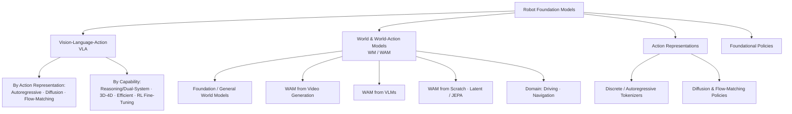

<div align="center">

# 🤖 Awesome World Action Models [](https://awesome.re)

**A curated, continuously-updated reading list of World Action Models (WAM), Vision-Language-Action (VLA) models, and Embodied AI — organized by a survey-grounded taxonomy.**

[](https://github.com/HyperbolicCurve/Awesome-World-Action-Model)
[](#-contributing)
[](LICENSE)
[](https://github.com/HyperbolicCurve/Awesome-World-Action-Model/stargazers)

 🌐 **Website:** [hyperboliccurve.github.io/Awesome-World-Action-Model](https://hyperboliccurve.github.io/Awesome-World-Action-Model/)

</div>

---

## Overview

The push toward **general-purpose robots** has produced two converging families of foundation models:

- **Vision-Language-Action (VLA)** models inherit the language grounding and visual understanding of pretrained **Vision-Language Models (VLMs)** and adapt them to emit actions — a scalable route to language-conditioned policies.
- **World Action Models (WAM)** start from a **world model / video backbone** that predicts *how a scene evolves*, and adapt that predictive prior to emit actions — trading the "language→motion" grounding gap for a "dynamics→action" one.

These two families overlap: a WAM built on a pretrained VLM is simultaneously a VLA *and* a WAM. This list maps that landscape with a taxonomy grounded in the recent survey literature (see [Surveys](#-surveys)), so each category has a clear, defensible scope rather than an ad-hoc label.

> [!NOTE]
> **Legend** — 📄 arXiv · 🌐 project page · 💻 code · 📊 dataset/benchmark. Tables are sorted newest-first within each category. The [🆕 Latest Papers](#-latest-papers-auto-updated) section is refreshed daily from arXiv by a [GitHub Action](.github/workflows/update-papers.yml); everything else is hand-curated.

---

## Taxonomy at a Glance



## Table of Contents

- [🔑 Key Definitions](#-key-definitions)
- [🆕 Latest Papers (Auto-updated)](#-latest-papers-auto-updated)
- [📚 Surveys](#-surveys)
- [🤖 Vision-Language-Action (VLA) Models](#-vision-language-action-vla-models)
  - [By Action Representation](#by-action-representation)
    - [Autoregressive / Discrete-Token VLA](#autoregressive--discrete-token-vla)
    - [Diffusion-based VLA](#diffusion-based-vla)
    - [Flow-Matching VLA](#flow-matching-vla)
  - [By Capability](#by-capability)
    - [Reasoning & Dual-System (Fast–Slow) VLA](#reasoning--dualsystem-fastslow-vla)
    - [3D / 4D-Aware VLA](#3d--4d-aware-vla)
    - [Efficient & Real-Time VLA](#efficient--real-time-vla)
    - [RL Fine-Tuning for VLA](#rl-fine-tuning-for-vla)
- [🌎 World & World-Action Models](#-world--world-action-models)
  - [Foundation / General World Models](#foundation--general-world-models)
  - [WAM from Video Generation](#wam-from-video-generation)
  - [WAM from VLMs](#wam-from-vlms)
  - [Unified VLA–World Models](#unified-vlaworld-models)
  - [Latent & JEPA World Models](#latent--jepa-world-models)
  - [Domain World Models (Driving & Navigation)](#domain-world-models-driving--navigation)
- [🧩 Action Representations & Tokenization](#-action-representations--tokenization)
- [🦾 Foundational Robot Policies](#-foundational-robot-policies)
- [📦 Resources](#-resources)
  - [Datasets](#datasets)
  - [Benchmarks](#benchmarks)
  - [Simulation Platforms](#simulation-platforms)
  - [Tools & Frameworks](#tools--frameworks)
- [🗂️ Extended Paper Index (Auto-Curated)](#️-extended-paper-index-auto-curated-newest-first)
- [📋 Full Paper Index & Baselines](#-full-paper-index--baselines)
- [🤝 Contributing](#-contributing)

---

## 🔑 Key Definitions

| Term | Definition | Canonical reference |
|------|------------|---------------------|
| **Vision-Language-Action (VLA)** | A robot policy that adapts a pretrained **VLM** to map images + language instructions to actions. | [RT-2](https://arxiv.org/abs/2307.15818) (Brohan et al., 2023) |
| **World Model (WM)** | A learned model that predicts future states of an environment (in pixels, latents, or 3D/4D), used for planning, simulation, or representation. | [World Models](https://arxiv.org/abs/1803.10122) (Ha & Schmidhuber, 2018) |
| **World Action Model (WAM)** | A policy that **leverages world-modeling capability (predicting future states) for action prediction** — typically by adapting a video / world-model backbone to emit actions. | [GR-1](https://arxiv.org/abs/2312.13139) (Wu et al., 2023) |

> [!IMPORTANT]
> **VLA ∩ WAM.** The families intersect: a WAM built on a pretrained VLM is *both*. The split in this list is by **what prior the model starts from** — VLM-style vision-language priors (VLA) vs. video/dynamics priors (WAM) — and, within VLA, by **how actions are represented**, the axis most surveys agree is the field's clearest discriminator.

---

## 🆕 Latest Papers (Auto-updated)

> Papers are automatically fetched daily from arXiv. Last updated: 2026-09-03

### VLA

| Paper | Date | Code |
|-------|------|------|
| [Toward Unified Robot Learning: Bridging Representation, Vision-Language-Action, and World Models](https://arxiv.org/abs/2609.03927v1)<br><small>Shaunak A. Mehta, Ananya Hazarika et al.</small> | 2026-09-03 |  |
| [FWBC-VLA: Force-Aware Whole-Body Compensation for Contact-Rich Loco-Manipulation](https://arxiv.org/abs/2609.03889v1)<br><small>Yutian Zhang, Siyuan Ma et al.</small> | 2026-09-03 |  |
| [WISE: World-model-guided Imagination Scheduling for Efficient Post-training of Vision-Language-Action Models](https://arxiv.org/abs/2609.03681v1)<br><small>Chenhao Zhang, Hanyu Zhao et al.</small> | 2026-09-03 |  |
| [Sensing Which Modality Matters: Evidence-Gated Regularization for Robust VLA Policies](https://arxiv.org/abs/2609.03142v1)<br><small>Yue Yang, Diego Romeres et al.</small> | 2026-09-02 |  |
| [Latent Cluster Analysis for Vision-Language-Action Models](https://arxiv.org/abs/2609.02634v1)<br><small>Theodor Wulff, Sergio Lanza et al.</small> | 2026-09-02 |  |
| [ZETA: A Controlled Study of Zero-Shot Cross-Embodiment VLA Transfer for Tabletop Manipulation](https://arxiv.org/abs/2609.02546v1)<br><small>Mi Yan, Wenhao Zhang et al.</small> | 2026-09-02 |  |
| [Towards Zero-Shot Transfer Across Embodiments For Driving VLAs](https://arxiv.org/abs/2609.02341v1)<br><small>Caio Azevedo, Stefano Sabatini et al.</small> | 2026-09-02 |  |
| [Evaluating Multimodal LLMs as Generalist Vision-Language-Action Agents for Drone Control: Commanding, Approaching, Tracking and Searching](https://arxiv.org/abs/2609.01404v1)<br><small>Jaewoo Park, Minyoung Lee et al.</small> | 2026-09-01 |  |
| [EmbodiedSkills: A Unified Framework for Orchestrating, Training, and Deploying VLA Agents](https://arxiv.org/abs/2609.01281v1)<br><small>Wei Wang, Wenqiao Zhang et al.</small> | 2026-09-01 |  |
| [REFACTOR-VLA: Unsupervised Library Learning of Typed Motor Programs](https://arxiv.org/abs/2609.01215v1)<br><small>Riyaaz Shaik, Chandru Venkataraman</small> | 2026-09-01 |  |

### World Model

| Paper | Date | Code |
|-------|------|------|
| [Spatially Aware World Action Model via Geometric Latent Diffusion](https://arxiv.org/abs/2609.02531v1)<br><small>Javier Alejandro Lopetegui Gonzalez, Paul Pacaud et al.</small> | 2026-09-02 |  |
| [World-Coherent Decoding: Self-Verifying Test-Time Planning for World Action Models](https://arxiv.org/abs/2609.02159v1)<br><small>Chuhan Zhang, Seiji Ito et al.</small> | 2026-09-02 |  |
| [ZimaBlue: Evolving Generalizable World Action Models through Scalable Video Pre-training](https://arxiv.org/abs/2609.00188v1)<br><small>Xionghao Wu, Yijun Yang et al.</small> | 2026-08-31 |  |
| [Hydra: A Navigation World Action Model with Discrete Latent Planning and Continuous Flow-Matching Execution](https://arxiv.org/abs/2608.28995v1)<br><small>Mohammad Nazeri, Alexandyr Card et al.</small> | 2026-08-29 |  |
| [Making Latent Evolution Explicit: Operator-Structured Transitions for World Action Models](https://arxiv.org/abs/2608.27259v1)<br><small>Xiaoxiao Lu, Yunlong Dong et al.</small> | 2026-08-27 |  |
| [Riemann-1.0: An Embodied World Action Model for Physical AI](https://arxiv.org/abs/2608.27033v1)<br><small>Haofeng Sun, Jiangbo Pei et al.</small> | 2026-08-27 |  |
| [4DGS-WAM: Bridging Past and Future with an Object-Centric World Action Model based on 4D Gaussian Splatting](https://arxiv.org/abs/2608.25956v1)<br><small>Yueen Ma, Zenglin Xu et al.</small> | 2026-08-26 |  |
| [GaussianDream++: Efficient 3D Gaussian World Modeling for Robotic Manipulation](https://arxiv.org/abs/2608.25659v1)<br><small>Yuqing Jiang, Zijian Zhang et al.</small> | 2026-08-26 |  |
| [Latent Action as Intention Enables Efficient Future Imagination for World Action Models](https://arxiv.org/abs/2608.24882v2)<br><small>Xiang Li, Yupeng Zheng et al.</small> | 2026-08-25 |  |
| [GameWAM: A World Action Model for Video Games](https://arxiv.org/abs/2608.26200v1)<br><small>Yuncheng Guo, Zhanqiu Zhang et al.</small> | 2026-08-25 |  |

### Policy

| Paper | Date | Code |
|-------|------|------|
| [Zero-WAM: In-Context World-Action Modeling from Human Videos for Open-Ended Task Generalization](https://arxiv.org/abs/2608.26103v2)<br><small>Jiaming Zhou, Qihang Zhang et al.</small> | 2026-08-26 |  |
| [GaussianWAM: Distilling Geometry and Semantics from 3D Gaussian Fields into World-Action Models](https://arxiv.org/abs/2608.24714v1)<br><small>Zijian Zhang, Yuqing Jiang et al.</small> | 2026-08-25 |  |
| [GlanceWAM: Sparse Test-Time Imagination for World-Action Models](https://arxiv.org/abs/2608.23927v1)<br><small>Linhan Wang, Zijian An et al.</small> | 2026-08-25 |  |
| [On the Capability Separation Between World-Model Policy Learning and Imitated World-Action Models](https://arxiv.org/abs/2608.22197v1)<br><small>Yang Yu</small> | 2026-08-23 |  |
| [DECOWAM: Decoupled Whole-Body World-Action Model for Legged Mobile Manipulation](https://arxiv.org/abs/2608.20114v2)<br><small>Siyuan Ma, Boshi Zhang et al.</small> | 2026-08-20 |  |

---


## 📚 Surveys

Recent surveys that define the field and motivate the taxonomy used here.

### World & Embodied World Models

| Title | Authors | Year | Links |
|-------|---------|------|-------|
| Understanding World or Predicting Future? A Comprehensive Survey of World Models | Ding et al. | 2024 | [📄](https://arxiv.org/abs/2411.14499) |
| A Comprehensive Survey on World Models for Embodied AI | Li et al. | 2025 | [📄](https://arxiv.org/abs/2510.16732) |
| 3D and 4D World Modeling: A Survey | Kong et al. | 2025 | [📄](https://arxiv.org/abs/2509.07996) |
| Learning Embodied Intelligence from Physical Simulators and World Models | Long et al. | 2025 | [📄](https://arxiv.org/abs/2507.00917) |
| Embodied AI: From LLMs to World Models | Feng et al. | 2025 | [📄](https://arxiv.org/abs/2509.20021) |
| World Model for Robot Learning: A Comprehensive Survey | Hou et al. | 2026 | [📄](https://arxiv.org/abs/2605.00080) |
| Modeling the Mental World for Embodied AI: A Comprehensive Review | Liu et al. | 2026 | [📄](https://arxiv.org/abs/2601.02378) |
| The Role of World Models in Shaping Autonomous Driving: A Survey | Tu et al. | 2025 | [📄](https://arxiv.org/abs/2502.10498) |

### Vision-Language-Action

| Title | Authors | Year | Links |
|-------|---------|------|-------|
| A Survey on Vision-Language-Action Models for Embodied AI | Ma et al. | 2024 | [📄](https://arxiv.org/abs/2405.14093) |
| A Survey on VLA Models: An Action Tokenization Perspective | Zhong et al. | 2025 | [📄](https://arxiv.org/abs/2507.01925) |
| VLA Models: Concepts, Progress, Applications and Challenges | Sapkota et al. | 2025 | [📄](https://arxiv.org/abs/2505.04769) |
| Large VLM-based VLA Models for Robotic Manipulation: A Survey | Shao et al. | 2025 | [📄](https://arxiv.org/abs/2508.13073) |
| Efficient VLA Models for Embodied Manipulation: A Systematic Survey | Guan et al. | 2025 | [📄](https://arxiv.org/abs/2510.17111) |
| VLA Models for Robotics: A Review Towards Real-World Applications | Kawaharazuka et al. | 2025 | [📄](https://arxiv.org/abs/2510.07077) · [🌐](https://vla-survey.github.io/) |
| An Anatomy of VLA Models: From Modules to Milestones and Challenges | — | 2025 | [📄](https://arxiv.org/abs/2512.11362) |
| Pure Vision-Language-Action Models: A Comprehensive Survey | — | 2025 | [📄](https://arxiv.org/abs/2509.19012) |
| A Survey on Efficient Vision-Language-Action Models | Yu et al. | 2025 | [📄](https://arxiv.org/abs/2510.24795) |
| A Survey on VLA Models for Autonomous Driving | Jiang et al. | 2025 | [📄](https://arxiv.org/abs/2506.24044) |
| VLA in Robotics: A Survey of Datasets, Benchmarks, and Data Engines | Wang et al. | 2026 | [📄](https://arxiv.org/abs/2604.23001) |

### Foundation Models & Embodied AI

| Title | Authors | Year | Links |
|-------|---------|------|-------|
| Foundation Models in Robotics: Applications, Challenges, and the Future | Firoozi et al. | 2023 | [📄](https://arxiv.org/abs/2312.07843) |
| Toward General-Purpose Robots via Foundation Models: A Survey | Hu et al. | 2023 | [📄](https://arxiv.org/abs/2312.08782) |
| Aligning Cyber Space with Physical World: A Survey on Embodied AI | Liu et al. | 2024 | [📄](https://arxiv.org/abs/2407.06886) |
| What Foundation Models Can Bring for Robot Learning in Manipulation: A Survey | Li et al. | 2024 | [📄](https://arxiv.org/abs/2404.18201) |
| Deep Reinforcement Learning for Robotics: A Survey of Real-World Successes | Tang et al. | 2024 | [📄](https://arxiv.org/abs/2408.03539) |
| Generative AI in Robotic Manipulation: A Survey | Zhang et al. | 2025 | [📄](https://arxiv.org/abs/2503.03464) |
| A Survey of Sim-to-Real Methods in RL with Foundation Models | Da et al. | 2025 | [📄](https://arxiv.org/abs/2502.13187) |
| Behavior Foundation Model: Towards Next-Generation Whole-Body Control of Humanoids | Yuan et al. | 2025 | [📄](https://arxiv.org/abs/2506.20487) |
| Towards a Unified Understanding of Robot Manipulation: A Comprehensive Survey | Bai et al. | 2025 | [📄](https://arxiv.org/abs/2510.10903) |
| Robotic Foundation Models for Industrial Control: A Survey & Readiness Assessment | Kube et al. | 2026 | [📄](https://arxiv.org/abs/2603.06749) |

---

## 🤖 Vision-Language-Action (VLA) Models

Following the *action-tokenization* view ([Zhong et al., 2025](https://arxiv.org/abs/2507.01925)), the primary split is by **how actions are represented**; capability-oriented subsections (reasoning, 3D/4D, efficiency, RL) cut across it. A few pre-/non-VLM generalist policies (e.g., RT-1, Octo) are listed alongside their successors to show lineage — see [Foundational Robot Policies](#-foundational-robot-policies) for the strictly non-VLA baselines.

### By Action Representation

#### Autoregressive / Discrete-Token VLA

> Actions are binned into discrete tokens and decoded like text. Simple and VLM-native; high-frequency dexterity needs better tokenizers (see [FAST](https://arxiv.org/abs/2501.09747)).

| Model | Title | Year | Links |
|-------|-------|------|-------|
| **VLA-0** | Building SOTA VLAs with Zero Modification | 2025 | [📄](https://arxiv.org/abs/2510.13054) · [🌐](https://vla0.github.io) |
| **UniVLA** | Unified Vision-Language-Action Model (native multimodal tokens) | 2025 | [📄](https://arxiv.org/abs/2506.19850) · [🌐](https://robertwyq.github.io/univla.github.io/) |
| **π0-FAST** | Autoregressive π0 variant using the FAST action tokenizer | 2025 | [📄](https://arxiv.org/abs/2501.09747) · [🌐](https://www.pi.website/research/fast) |
| **OpenVLA** | An Open-Source Vision-Language-Action Model | 2024 | [📄](https://arxiv.org/abs/2406.09246) · [🌐](https://openvla.github.io) · [💻](https://github.com/openvla/openvla) |
| **RT-2** | VLA Models Transfer Web Knowledge to Robotic Control | 2023 | [📄](https://arxiv.org/abs/2307.15818) · [🌐](https://robotics-transformer2.github.io) |
| **RT-1** | Robotics Transformer for Real-World Control at Scale | 2022 | [📄](https://arxiv.org/abs/2212.06817) · [🌐](https://robotics-transformer1.github.io) · [💻](https://github.com/google-research/robotics_transformer) |

#### Diffusion-based VLA

> A diffusion action head denoises continuous action chunks conditioned on vision-language features.

| Model | Title | Year | Links |
|-------|-------|------|-------|
| **RoboVLMs** | Towards Generalist Robot Policies: What Matters in Building VLAs | 2024 | [📄](https://arxiv.org/abs/2412.14058) · [🌐](https://robovlms.github.io) |
| **CogACT** | A Foundational VLA Model for Synergizing Cognition and Action | 2024 | [📄](https://arxiv.org/abs/2411.19650) |
| **TinyVLA** | Fast, Data-Efficient VLA Models for Manipulation | 2024 | [📄](https://arxiv.org/abs/2409.12514) · [🌐](https://tiny-vla.github.io) |
| **Octo** | An Open-Source Generalist Robot Policy | 2024 | [📄](https://arxiv.org/abs/2405.12213) · [🌐](https://octo-models.github.io) · [💻](https://github.com/octo-models/octo) |

#### Flow-Matching VLA

> A conditional flow/vector field transports noise to action chunks — the dominant head for current SOTA generalist VLAs.

| Model | Title | Year | Links |
|-------|-------|------|-------|
| **π*0.6** | A VLA That Learns From Experience | 2025 | [📄](https://arxiv.org/abs/2511.14759) · [🌐](https://www.pi.website/blog/pistar06) |
| **X-VLA** | Soft-Prompted Transformer as a Scalable Cross-Embodiment VLA | 2025 | [📄](https://arxiv.org/abs/2510.10274) · [🌐](https://thu-air-dream.github.io/X-VLA/) · [💻](https://github.com/2toinf/X-VLA) |
| **SmolVLA** | A VLA for Affordable and Efficient Robotics | 2025 | [📄](https://arxiv.org/abs/2506.01844) · [💻](https://github.com/huggingface/lerobot) |
| **π0.5** | A VLA with Open-World Generalization | 2025 | [📄](https://arxiv.org/abs/2504.16054) · [🌐](https://www.pi.website/blog/pi05) |
| **Gemini Robotics** | Bringing AI into the Physical World | 2025 | [📄](https://arxiv.org/abs/2503.20020) · [🌐](https://deepmind.google/models/gemini-robotics/) |
| **GR00T N1** | An Open Foundation Model for Generalist Humanoid Robots | 2025 | [📄](https://arxiv.org/abs/2503.14734) · [💻](https://github.com/NVIDIA/Isaac-GR00T) |
| **EO-1** | An Open Unified Embodied Foundation Model (interleaved reasoning + acting) | 2025 | [📄](https://arxiv.org/abs/2508.21112) · [🌐](https://eo-robotics.ai/eo-1) |
| **GR-3** | Large-Scale Vision-Language-Action Model (Technical Report) | 2025 | [📄](https://arxiv.org/abs/2507.15493) |
| **FLOWER** | Democratizing Generalist Robot Policies with Efficient VLA Flow Policies | 2025 | [📄](https://arxiv.org/abs/2509.04996) |
| **π0** | A Vision-Language-Action Flow Model for General Robot Control | 2024 | [📄](https://arxiv.org/abs/2410.24164) · [🌐](https://www.pi.website/blog/pi0) |

### By Capability

#### Reasoning & Dual-System (Fast–Slow) VLA

> Explicit chain-of-thought / embodied reasoning, or a slow System-2 planner paired with a fast System-1 controller.

| Model | Title | Year | Links |
|-------|-------|------|-------|
| **ACoT-VLA** | Action Chain-of-Thought for VLA Models | 2026 | [📄](https://arxiv.org/abs/2601.11404) · [💻](https://github.com/AgibotTech/ACoT-VLA) |
| **Gemini Robotics 1.5** | Embodied Reasoning & Motion Transfer | 2025 | [📄](https://arxiv.org/abs/2510.03342) |
| **ThinkAct** | VLA Reasoning via Reinforced Visual Latent Planning | 2025 | [📄](https://arxiv.org/abs/2507.16815) |
| **OpenHelix** | A Short Survey & Open-Source Dual-System VLA | 2025 | [📄](https://arxiv.org/abs/2505.03912) |
| **FiS-VLA** | Fast-in-Slow: A Dual-System Foundation Model for Unified Fast–Slow Reasoning | 2025 | [📄](https://arxiv.org/abs/2506.01953) |
| **WALL-OSS** | Igniting VLMs toward the Embodied Space | 2025 | [📄](https://arxiv.org/abs/2509.11766) · [💻](https://github.com/X-Square-Robot/wall-x) |
| **CoT-VLA** | Visual Chain-of-Thought Reasoning for VLA | 2025 | [📄](https://arxiv.org/abs/2503.22020) |

#### 3D / 4D-Aware VLA

> Policies that reason over explicit 3D/4D structure (point clouds, occupancy, predicted future frames) rather than 2D images alone. (VoxPoser, a zero-shot 3D value-map planner, lives under [Foundational Robot Policies](#-foundational-robot-policies).)

| Model | Title | Year | Links |
|-------|-------|------|-------|
| **3D-VLA** | A 3D Vision-Language-Action Generative World Model | 2024 | [📄](https://arxiv.org/abs/2403.09631) |

#### Efficient & Real-Time VLA

> Compression, caching, parallel decoding, and distillation to make VLAs small and fast enough for real-time / edge control ([Guan et al., 2025](https://arxiv.org/abs/2510.17111)).

| Model | Title | Year | Links |
|-------|-------|------|-------|
| **FASTER** | Rethinking Real-Time Flow VLAs | 2026 | [📄](https://arxiv.org/abs/2603.19199) |
| **RTC** | Real-Time Chunking: Running VLAs at Real-Time Speed | 2025 | [📄](https://arxiv.org/abs/2510.26742) |
| **NanoVLA** | Routing-Decoupled VLA for Nano-Sized Generalist Policies | 2025 | [📄](https://arxiv.org/abs/2510.25122) |
| **VLA-Adapter** | A Tiny-Scale VLA Paradigm | 2025 | [📄](https://arxiv.org/abs/2509.09372) |
| **OpenVLA-OFT** | Fine-Tuning VLAs: Optimizing Speed and Success | 2025 | [📄](https://arxiv.org/abs/2502.19645) · [🌐](https://openvla-oft.github.io) |
| **TinyVLA** | Fast, Data-Efficient VLA Models | 2024 | [📄](https://arxiv.org/abs/2409.12514) · [🌐](https://tiny-vla.github.io) |

#### RL Fine-Tuning for VLA

> Reinforcement learning (often on top of flow-/diffusion-based VLAs) to improve over imitation-only training.

| Model | Title | Year | Links |
|-------|-------|------|-------|
| **π_RL** | Online RL Fine-Tuning for Flow-based VLAs | 2025 | [📄](https://arxiv.org/abs/2510.25889) |
| **VLA-RFT** | RL Fine-Tuning with Verified Rewards in World Simulators | 2025 | [📄](https://arxiv.org/abs/2510.00406) |
| **SimpleVLA-RL** | Scaling VLA Training via Reinforcement Learning | 2025 | [📄](https://arxiv.org/abs/2509.09674) |
| **ConRFT** | A Reinforced Fine-Tuning Method for VLA via Consistency Policy | 2025 | [📄](https://arxiv.org/abs/2502.05450) |

---

## 🌎 World & World-Action Models

Organized by **what the model predicts and how it is built**, following the embodied-world-model taxonomy of [Li et al., 2025](https://arxiv.org/abs/2510.16732) and the WAM split popularized by [awesome-vla-wam](https://github.com/DravenALG/awesome-vla-wam).

### General World Models

> General-purpose models of environment dynamics — spanning classical latent world models for model-based RL (World Models, DreamerV3) and modern large-scale video / foundation world models — used for planning, neural simulation, or as backbones for WAMs.

| Model | Title | Year | Links |
|-------|-------|------|-------|
| **Cosmos-Predict2.5** | World Simulation with Video Foundation Models for Physical AI | 2025 | [📄](https://arxiv.org/abs/2511.00062) · [💻](https://github.com/nvidia-cosmos/cosmos-predict2.5) |
| **Cosmos-Reason1** | From Physical Common Sense to Embodied Reasoning | 2025 | [📄](https://arxiv.org/abs/2503.15558) |
| **Cosmos** | World Foundation Model Platform for Physical AI | 2025 | [📄](https://arxiv.org/abs/2501.03575) · [🌐](https://developer.nvidia.com/cosmos) |
| **V-JEPA 2** | Self-Supervised Video Models Enable Understanding, Prediction & Planning | 2025 | [📄](https://arxiv.org/abs/2506.09985) |
| **iVideoGPT** | Interactive VideoGPTs are Scalable World Models | 2024 | [📄](https://arxiv.org/abs/2405.15223) |
| **Genie** | Generative Interactive Environments | 2024 | [📄](https://arxiv.org/abs/2402.15391) |
| **DreamerV3** | Mastering Diverse Domains through World Models | 2023 | [📄](https://arxiv.org/abs/2301.04104) · [💻](https://github.com/danijar/dreamerv3) |
| **UniSim** | Learning Interactive Real-World Simulators | 2023 | [📄](https://arxiv.org/abs/2310.06114) |
| **World Models** | Recurrent latent world model + controller (origin of the term) | 2018 | [📄](https://arxiv.org/abs/1803.10122) |

### WAM from Video Generation

> A (text-/image-conditioned) video generator imagines future frames; actions are recovered via an inverse-dynamics / action head.

| Model | Title | Year | Links |
|-------|-------|------|-------|
| **DreamZero** | World Action Models are Zero-shot Policies | 2026 | [📄](https://arxiv.org/abs/2602.15922) · [🌐](https://dreamzero0.github.io) |
| **DiT4DiT** | Jointly Modeling Video Dynamics and Actions | 2026 | [📄](https://arxiv.org/abs/2603.10448) |
| **Cosmos Policy** | Fine-Tuning Video Models for Visuomotor Control & Planning | 2026 | [📄](https://arxiv.org/abs/2601.16163) · [🌐](https://developer.nvidia.com/cosmos) |
| **Video2Act** | A Dual-System Video Diffusion Policy | 2025 | [📄](https://arxiv.org/abs/2512.03044) |
| **GR-2** | A Generative Video-Language-Action Model with Web-Scale Knowledge | 2024 | [📄](https://arxiv.org/abs/2410.06158) |
| **GR-1** | Large-Scale Video Generative Pre-training for Visual Robot Manipulation | 2023 | [📄](https://arxiv.org/abs/2312.13139) |

### WAM from VLMs

> A pretrained VLM is turned into a world model (e.g., predicting goal images / object-centric futures) that then drives action.

| Model | Title | Year | Links |
|-------|-------|------|-------|
| **DreamVLA** | A VLA Model Dreamed with Comprehensive World Knowledge | 2025 | [📄](https://arxiv.org/abs/2507.04447) |
| **Goal-VLA** | Image-Generative VLMs as Object-Centric World Models for VLA | 2025 | [📄](https://arxiv.org/abs/2506.23919) |

### Unified VLA–World Models

> Single architectures that jointly learn to **act** and to **predict world dynamics**, blurring the VLA/WAM boundary.

| Model | Title | Year | Links |
|-------|-------|------|-------|
| **RynnVLA-002** | A Unified Vision-Language-Action and World Model | 2025 | [📄](https://arxiv.org/abs/2511.17502) · [💻](https://github.com/alibaba-damo-academy/RynnVLA-002) |
| **WholeBodyVLA** | Unified Latent VLA for Whole-Body Loco-Manipulation | 2025 | [📄](https://arxiv.org/abs/2512.11047) · [💻](https://github.com/OpenDriveLab/WholebodyVLA) |
| **WorldVLA** | Towards an Autoregressive Action World Model | 2025 | [📄](https://arxiv.org/abs/2506.21539) · [💻](https://github.com/alibaba-damo-academy/WorldVLA) |

### Latent & JEPA World Models

> Self-supervised *latent* predictive models (non-reconstructive joint-embedding / JEPA). The JEPA foundations (I-JEPA) learn to predict in representation space; the action-conditioned variant (V-JEPA 2-AC) turns that prior into a world model for planning.

| Model | Title | Year | Links |
|-------|-------|------|-------|
| **V-JEPA 2-AC** | Action-Conditioned Latent World Model for Zero-Shot Planning | 2025 | [📄](https://arxiv.org/abs/2506.09985) |
| **I-JEPA** | Image-based Joint-Embedding Predictive Architecture (representation foundation) | 2023 | [📄](https://arxiv.org/abs/2301.08243) |

### Domain World Models (Driving & Navigation)

| Model | Title | Year | Links |
|-------|-------|------|-------|
| **GAIA-2** | A Controllable Multi-View Generative World Model for Autonomous Driving | 2025 | [📄](https://arxiv.org/abs/2503.20523) |
| **Navigation World Models** | Conditional Diffusion Transformer for Navigation | 2024 | [📄](https://arxiv.org/abs/2412.03572) |
| **GAIA-1** | A Generative World Model for Autonomous Driving | 2023 | [📄](https://arxiv.org/abs/2309.17080) |

---

## 🧩 Action Representations & Tokenization

Building blocks shared across VLA and WAM policies — how continuous actions become learnable targets.

### Discrete / Autoregressive Tokenizers

| Method | Title | Year | Links |
|--------|-------|------|-------|
| **FAST** | Efficient (DCT-based) Action Tokenization for VLAs | 2025 | [📄](https://arxiv.org/abs/2501.09747) · [🌐](https://www.pi.website/research/fast) |
| **BeT** | Behavior Transformers: Cloning *k* Modes with One Stone | 2022 | [📄](https://arxiv.org/abs/2206.11251) |

### Continuous & Chunked Action Policies

> Heads that emit continuous action chunks — by denoising diffusion (Diffusion Policy) or by chunked sequence prediction with a CVAE (ACT). Flow-matching heads (π0, SmolVLA, …) are listed with their models under [Flow-Matching VLA](#flow-matching-vla).

| Method | Title | Year | Links |
|--------|-------|------|-------|
| **Diffusion Policy** | Visuomotor Policy Learning via Action Diffusion | 2023 | [📄](https://arxiv.org/abs/2303.04137) · [🌐](https://diffusion-policy.cs.columbia.edu) |
| **ACT / ALOHA** | Action Chunking with Transformers | 2023 | [📄](https://arxiv.org/abs/2304.13705) · [🌐](https://tonyzhaozh.github.io/aloha/) |

---

## 🦾 Foundational Robot Policies

Non-VLA policies and planners that remain standard baselines in the experimental tables of the papers above. (Diffusion Policy, ACT, and BeT are described under [Action Representations](#-action-representations--tokenization).)

| Method | Title | Year | Links |
|--------|-------|------|-------|
| **CrossFormer** | Scaling Cross-Embodied Learning: One Policy for Manipulation, Navigation, Locomotion & Flight | 2024 | [📄](https://arxiv.org/abs/2408.11812) · [💻](https://github.com/rail-berkeley/crossformer) |
| **RoboFlamingo** | Vision-Language Foundation Models as Effective Robot Imitators | 2023 | [📄](https://arxiv.org/abs/2311.01378) · [💻](https://github.com/RoboFlamingo/RoboFlamingo) |
| **VoxPoser** | Composable 3D Value Maps for Robotic Manipulation (zero-shot LLM + 3D planner) | 2023 | [📄](https://arxiv.org/abs/2307.05973) · [🌐](https://voxposer.github.io) |
| **RT-1** | Robotics Transformer for Real-World Control at Scale | 2022 | [📄](https://arxiv.org/abs/2212.06817) |

---

## 📦 Resources

### Datasets

| Name | Description | Scale | Links |
|------|-------------|-------|-------|
| **Open X-Embodiment** | Cross-embodiment aggregation behind the RT-X models | 1M+ traj · 22 embodiments | [📄](https://arxiv.org/abs/2310.08864) · [🌐](https://robotics-transformer-x.github.io/) |
| **AgiBot World** | Large-scale real-world manipulation (Colosseo) | 1M+ traj · 217 tasks | [📄](https://arxiv.org/abs/2503.06669) · [🌐](https://agibot-world.com/) |
| **EgoScale** | Scaling dexterous manipulation with diverse egocentric human data | egocentric · 2026 | [📄](https://arxiv.org/abs/2602.16710) |
| **DexCanvas** | Human demos ↔ robot learning for dexterous manipulation | dexterous | [📄](https://arxiv.org/abs/2510.15786) |
| **Galaxea Open-World** | Mobile-bimanual dataset paired with the G0 dual-system VLA | 500 hrs · 150 tasks | [📄](https://arxiv.org/abs/2509.00576) · [💻](https://github.com/OpenGalaxea) |
| **DROID** | In-the-wild Franka manipulation across 3 continents | 76K traj · 564 scenes | [📄](https://arxiv.org/abs/2403.12945) · [🌐](https://droid-dataset.github.io/) |
| **RoboMIND** | Multi-embodiment teleop incl. labeled failures | 107K traj · 479 tasks | [📄](https://arxiv.org/abs/2412.13877) · [🌐](https://x-humanoid-robomind.github.io/) |
| **BridgeData V2** | WidowX manipulation w/ language + goal images | 60K traj · 24 envs | [📄](https://arxiv.org/abs/2308.12952) · [🌐](https://rail-berkeley.github.io/bridgedata/) |
| **RH20T** | Contact-rich skills w/ paired human demos | 110K+ seq · 147 tasks | [📄](https://arxiv.org/abs/2307.00595) · [🌐](https://rh20t.github.io/) |
| **Ego-Exo4D** | Simultaneous ego + exo video of skilled activity | 1,286 hrs | [📄](https://arxiv.org/abs/2311.18259) · [🌐](https://ego-exo4d-data.org/) |
| **Ego4D** | Massive egocentric daily-life video | 3,670 hrs | [📄](https://arxiv.org/abs/2110.07058) · [🌐](https://ego4d-data.org/) |

### Benchmarks

| Name | Description | Links |
|------|-------------|-------|
| **LIBERO** | Lifelong robot-learning, 130 manipulation tasks (de-facto VLA eval) | [📄](https://arxiv.org/abs/2306.03310) · [💻](https://github.com/Lifelong-Robot-Learning/LIBERO) |
| **CALVIN** | Long-horizon language-conditioned manipulation | [📄](https://arxiv.org/abs/2112.03227) · [💻](https://github.com/mees/calvin) |
| **SimplerEnv** | Real-to-sim evaluation for manipulation policies | [📄](https://arxiv.org/abs/2405.05941) · [🌐](https://simpler-env.github.io/) |
| **RoboCasa** | Large-scale kitchen simulation (100 tasks) | [📄](https://arxiv.org/abs/2406.02523) · [🌐](https://robocasa.ai/) |
| **VLABench** | World-knowledge & long-horizon language tasks | [📄](https://arxiv.org/abs/2412.18194) · [🌐](https://vlabench.github.io/) |
| **ManiSkill3** | GPU-parallel manipulation (30K+ FPS) | [📄](https://arxiv.org/abs/2410.00425) · [🌐](https://maniskill.ai/) |
| **THE COLOSSEUM** | Robustness under 14 environmental perturbations | [📄](https://arxiv.org/abs/2402.08191) · [🌐](https://robot-colosseum.github.io/) |
| **RoboArena** | Distributed crowd-sourced *real-world* policy eval | [📄](https://arxiv.org/abs/2506.18123) · [🌐](https://robo-arena.github.io/) |
| **RoboChallenge** | Large-scale real-robot evaluation of embodied policies | [📄](https://arxiv.org/abs/2510.17950) |
| **RobotArena ∞** | Scalable robot benchmarking via real-to-sim translation | [📄](https://arxiv.org/abs/2510.23571) · [🌐](https://robotarenainf.github.io) |
| **WorldArena** | Perception & functional-utility benchmark for embodied world models | [📄](https://arxiv.org/abs/2602.08971) |
| **Meta-World** | 50 tabletop tasks for multi-task / meta-RL | [📄](https://arxiv.org/abs/1910.10897) · [💻](https://github.com/Farama-Foundation/Metaworld) |
| **RLBench** | 100 hand-designed manipulation tasks | [📄](https://arxiv.org/abs/1909.12271) · [💻](https://github.com/stepjam/RLBench) |

### Simulation Platforms

| Name | Description | Links |
|------|-------------|-------|
| **Isaac Sim / Isaac Lab** | GPU-native robotics sim + RL/IL framework (Omniverse/USD) | [🌐](https://github.com/isaac-sim/IsaacLab) |
| **MuJoCo / MJX** | Standard rigid-body engine + JAX/XLA parallel variant | [🌐](https://github.com/google-deepmind/mujoco) |
| **Genesis** | Generative, multi-solver physics platform (up to ~43M FPS) | [🌐](https://github.com/Genesis-Embodied-AI/Genesis) |
| **ManiSkill** | GPU-parallel manipulation simulator on SAPIEN | [🌐](https://github.com/haosulab/ManiSkill) |
| **SAPIEN** | Part-level articulated-object simulator (PartNet-Mobility) | [📄](https://arxiv.org/abs/2003.08515) · [🌐](https://sapien.ucsd.edu/) |
| **Habitat** | Photorealistic indoor navigation & rearrangement | [🌐](https://github.com/facebookresearch/habitat-sim) |
| **ThreeDWorld** | Multimodal Unity3D sim (vision + audio + physics) | [📄](https://arxiv.org/abs/2007.04954) · [🌐](https://www.threedworld.org/) |
| **Newton** | Open, differentiable GPU physics engine (NVIDIA + DeepMind + Disney) | [🌐](https://github.com/newton-physics/newton) |

### Tools & Frameworks

| Name | Description | Links |
|------|-------------|-------|
| **LeRobot** | End-to-end PyTorch robot-learning library + datasets + low-cost HW | [📄](https://arxiv.org/abs/2602.22818) · [💻](https://github.com/huggingface/lerobot) |
| **openpi** | Open models & training/inference for π0, π0-FAST, π0.5 | [💻](https://github.com/Physical-Intelligence/openpi) |
| **Isaac GR00T** | Open humanoid foundation-model framework + checkpoints | [💻](https://github.com/NVIDIA/Isaac-GR00T) |
| **OpenVLA** | Training / LoRA fine-tuning for the 7B OpenVLA model | [💻](https://github.com/openvla/openvla) |
| **Octo** | JAX/Flax generalist transformer policy on OXE | [💻](https://github.com/octo-models/octo) |
| **robomimic / robosuite** | Learning-from-demonstration framework + MuJoCo manipulation sim | [💻](https://github.com/ARISE-Initiative/robomimic) |
| **HIL-SERL** | Human-in-the-loop, sample-efficient real-world RL | [💻](https://github.com/rail-berkeley/hil-serl) |

---

<!-- EXT-PAPERS:start -->
## 🗂️ Extended Paper Index (Auto-Curated, Newest First)

> A broader, continuously-mined index of recent arXiv work that complements the curated highlights above — **158 additional papers**, newest first. Last updated: 2026-03-31. Auto-generated from `data/*.json` by [`scripts/expand_papers.py`](scripts/expand_papers.py); papers already highlighted above are omitted here to avoid duplication.

<details>
<summary><b>VLA — General & Manipulation</b> · 37 papers</summary>

| Paper | Authors | Date | Links |
|-------|---------|------|-------|
| [FocusVLA: Focused Visual Utilization for Vision-Language-Action Models](http://arxiv.org/abs/2603.28740v1) | Yichi Zhang, Weihao Yuan et al. | 2026-03-30 |  |
| [ProgressVLA: Progress-Guided Diffusion Policy for Vision-Language Robotic Manipulation](http://arxiv.org/abs/2603.27670v1) | Hongyu Yan, Qiwei Li et al. | 2026-03-29 |  |
| [MMaDA-VLA: Large Diffusion Vision-Language-Action Model with Unified Multi-Modal Instruction and Generation](http://arxiv.org/abs/2603.25406v2) | Yang Liu, Pengxiang Ding et al. | 2026-03-26 |  |
| [ThermoAct:Thermal-Aware Vision-Language-Action Models for Robotic Perception and Decision-Making](http://arxiv.org/abs/2603.25044v2) | Young-Chae Son, Dae-Kwan Ko et al. | 2026-03-26 |  |
| [$π$, But Make It Fly: Physics-Guided Transfer of VLA Models to Aerial Manipulation](http://arxiv.org/abs/2603.25038v1) | Johnathan Tucker, Denis Liu et al. | 2026-03-26 |  |
| [TAG: Target-Agnostic Guidance for Stable Object-Centric Inference in Vision-Language-Action Models](http://arxiv.org/abs/2603.24584v1) | Jiaying Zhou, Zhihao Zhan et al. | 2026-03-25 |  |
| [VTAM: Video-Tactile-Action Models for Complex Physical Interaction Beyond VLAs](http://arxiv.org/abs/2603.23481v1) | Haoran Yuan, Weigang Yi et al. | 2026-03-24 |  |
| [Gaze-Regularized Vision-Language-Action Models for Robotic Manipulation](http://arxiv.org/abs/2603.23202v1) | Anupam Pani, Yanchao Yang | 2026-03-24 |  |
| [CoMaTrack: Competitive Multi-Agent Game-Theoretic Tracking with Vision-Language-Action Models](http://arxiv.org/abs/2603.22846v2) | Youzhi Liu, Li Gao et al. | 2026-03-24 |  |
| [ProbeFlow: Training-Free Adaptive Flow Matching for Vision-Language-Action Models](http://arxiv.org/abs/2603.17850v1) | Zhou Fang, Jiaqi Wang et al. | 2026-03-18 |  |
| [The Steep-spectrum Radio-loud AGN Luminosity Function and Its Implications for Black Hole Growth and Star Formation](http://arxiv.org/abs/2603.15449v1) | Wenjie Wang, Zunli Yuan et al. | 2026-03-16 |  |
| [Building Explicit World Model for Zero-Shot Open-World Object Manipulation](http://arxiv.org/abs/2603.13825v1) | Xiaotong Li, Gang Chen et al. | 2026-03-14 |  |
| [Beyond Dense Futures: World Models as Structured Planners for Robotic Manipulation](http://arxiv.org/abs/2603.12553v1) | Minghao Jin, Mozheng Liao et al. | 2026-03-13 |  |
| [Adaptive Capacity Allocation for Vision Language Action Fine-tuning](http://arxiv.org/abs/2603.07404v1) | Donghoon Kim, Minji Bae et al. | 2026-03-08 |  |
| [HarvestFlex: Strawberry Harvesting via Vision-Language-Action Policy Adaptation in the Wild](http://arxiv.org/abs/2603.05982v1) | Ziyang Zhao, Shuheng Wang et al. | 2026-03-06 |  |
| [CRAFT: Adapting VLA Models to Contact-rich Manipulation via Force-aware Curriculum Fine-tuning](http://arxiv.org/abs/2602.12532v1) | Yike Zhang, Yaonan Wang et al. | 2026-02-13 |  |
| [HoloBrain-0 Technical Report](https://arxiv.org/abs/2602.12062) | Horizon Robotics | 2026-02-07 | [🌐](https://horizonrobotics.github.io/robot_lab/holobrain/) |
| [CLARE: Continual Learning for Vision-Language-Action Models via Autonomous Adapter Routing and Expansion](http://arxiv.org/abs/2601.09512v1) | Ralf Römer, Yi Zhang et al. | 2026-01-14 |  |
| [Diverse stages of star formation in the IRAS 18162-2048 region. Emergence of UV Feedback](http://arxiv.org/abs/2512.07604v2) | R. Fedriani, G. Anglada et al. | 2025-12-08 |  |
| [Mixture of Horizons in Action Chunking](http://arxiv.org/abs/2511.19433v1) | Dong Jing, Gang Wang et al. | 2025-11-24 |  |
| [A scaling relationship for non-thermal radio emission from ordered magnetospheres - II. Investigating the efficiency of relativistic electron production in magnetospheres of BA-type stars](http://arxiv.org/abs/2511.05378v1) | P. Leto, S. Owocki et al. | 2025-11-07 |  |
| [First X-ray and radio polarimetry of the neutron star low-mass X-ray binary GX 17+2](http://arxiv.org/abs/2510.05284v1) | Unnati Kashyap, Thomas J. Maccarone et al. | 2025-10-06 |  |
| [Deciphering the radio-star formation correlation on kpc scales. IV. Radio halos of highly-inclined Virgo cluster spiral galaxies](http://arxiv.org/abs/2510.03098v1) | B. Vollmer, M. Soida et al. | 2025-10-03 |  |
| [Masses, Star-Formation Efficiencies, and Dynamical Evolution of 18,000 HII Regions](http://arxiv.org/abs/2509.22789v1) | Debosmita Pathak, Adam K. Leroy et al. | 2025-09-26 |  |
| [X-ray and radio polarimetry of the neutron star low mass X-ray binary GX 13+1](http://arxiv.org/abs/2508.05763v1) | Unnati Kashyap, Thomas J. Maccarone et al. | 2025-08-07 |  |
| [Protostellar Outflows at the EarliesT Stages (POETS). VIII. The jets in the intermediate-mass star-forming region G105.42+9.88 (alias LkHα 234)](http://arxiv.org/abs/2508.03161v1) | Luca Moscadelli, Fabrizio Massi et al. | 2025-08-05 |  |
| [Star formation histories and gas content limits of three ultra-faint dwarfs on the periphery of M31](http://arxiv.org/abs/2508.00984v2) | Michael G. Jones, David J. Sand et al. | 2025-08-01 |  |
| [Quenching Through Tidal Gas Removal: Molecular Gas and Star Formation in Tidal Tails of z ~ 0.7 Post-Starburst Galaxies](http://arxiv.org/abs/2507.21249v1) | Vincenzo R. D'Onofrio, Justin S. Spilker et al. | 2025-07-28 |  |
| [AC-DiT: Adaptive Coordination Diffusion Transformer for Mobile Manipulation](http://arxiv.org/abs/2507.01961v3) | Sixiang Chen, Jiaming Liu et al. | 2025-07-02 |  |
| [The Radio Spectral Energy Distribution and Star Formation Calibration in MIGHTEE-COSMOS Highly Star-Forming Galaxies at 1.5 < z < 3.5](http://arxiv.org/abs/2506.16275v1) | Fatemeh Tabatabaei, Maryam Khademi et al. | 2025-06-19 |  |
| [Semi-empirical constraints on the HI mass function of star-forming galaxies and $Ω_{\rm HI}$ at $z\sim 0.37$ from interferometric surveys](http://arxiv.org/abs/2506.11280v2) | Francesco Sinigaglia, Alessandro Bianchetti et al. | 2025-06-12 |  |
| [A persistent disk wind and variable jet outflow in the neutron-star low-mass X-ray binary GX 13+1](http://arxiv.org/abs/2504.05452v1) | Daniele Rogantini, Jeroen Homan et al. | 2025-04-07 |  |
| [X-ray and radio data obtained by XMM-Newton and VLA constrain the stellar wind of the magnetic quasi-Wolf-Rayet star in HD45166](http://arxiv.org/abs/2503.07205v1) | P. Leto, L. M. Oskinova et al. | 2025-03-10 |  |
| [The Arp 240 Galaxy Merger: A Detailed Look at the Molecular Kennicutt-Schmidt Star Formation Law on Sub-kpc Scales](http://arxiv.org/abs/2412.07985v1) | Alejandro Saravia, Eduardo Rodas-Quito et al. | 2024-12-10 |  |
| [Runaway O and Be stars found using Gaia DR3, new stellar bow shocks and search for binaries](http://arxiv.org/abs/2412.07738v1) | M. Carretero-Castrillo, M. Ribó et al. | 2024-12-10 |  |
| [A-VL: Adaptive Attention for Large Vision-Language Models](http://arxiv.org/abs/2409.14846v2) | Junyang Zhang, Mu Yuan et al. | 2024-09-23 |  |
| [HiRT: Enhancing Robotic Control with Hierarchical Robot Transformers](http://arxiv.org/abs/2410.05273v3) | Jianke Zhang, Yanjiang Guo et al. | 2024-09-12 |  |

</details>

<details>
<summary><b>VLA — Reasoning, Planning & Dual-System</b> · 5 papers</summary>

| Paper | Authors | Date | Links |
|-------|---------|------|-------|
| [Do World Action Models Generalize Better than VLAs? A Robustness Study](http://arxiv.org/abs/2603.22078v1) | Zhanguang Zhang, Zhiyuan Li et al. | 2026-03-23 |  |
| [Act, Think or Abstain: Complexity-Aware Adaptive Inference for Vision-Language-Action Models](http://arxiv.org/abs/2603.05147v1) | Riccardo Andrea Izzo, Gianluca Bardaro et al. | 2026-03-05 |  |
| [Chain of World: World Model Thinking in Latent Motion](http://arxiv.org/abs/2603.03195v1) | Fuxiang Yang, Donglin Di et al. | 2026-03-03 |  |
| [FRAPPE: Infusing World Modeling into Generalist Policies via Multiple Future Representation Alignment](http://arxiv.org/abs/2602.17259v1) | Han Zhao, Jingbo Wang et al. | 2026-02-19 |  |
| [VGAS: Value-Guided Action-Chunk Selection for Few-Shot Vision-Language-Action Adaptation](http://arxiv.org/abs/2602.07399v1) | Changhua Xu, Jie Lu et al. | 2026-02-07 |  |

</details>

<details>
<summary><b>VLA — Autonomous Driving</b> · 10 papers</summary>

| Paper | Authors | Date | Links |
|-------|---------|------|-------|
| [StreamingVLA: Streaming Vision-Language-Action Model with Action Flow Matching and Adaptive Early Observation](http://arxiv.org/abs/2603.28565v1) | Yiran Shi, Dongqi Guo et al. | 2026-03-30 |  |
| [Uni-World VLA: Interleaved World Modeling and Planning for Autonomous Driving](http://arxiv.org/abs/2603.27287v1) | Qiqi Liu, Huan Xu et al. | 2026-03-28 |  |
| [Vega: Learning to Drive with Natural Language Instructions](http://arxiv.org/abs/2603.25741v2) | Sicheng Zuo, Yuxuan Li et al. | 2026-03-26 |  |
| [Drive My Way: Preference Alignment of Vision-Language-Action Model for Personalized Driving](http://arxiv.org/abs/2603.25740v1) | Zehao Wang, Huaide Jiang et al. | 2026-03-26 |  |
| [ETA-VLA: Efficient Token Adaptation via Temporal Fusion and Intra-LLM Sparsification for Vision-Language-Action Models](http://arxiv.org/abs/2603.25766v1) | Yiru Wang, Anqing Jiang et al. | 2026-03-26 |  |
| [VLA-IAP: Training-Free Visual Token Pruning via Interaction Alignment for Vision-Language-Action Models](http://arxiv.org/abs/2603.22991v1) | Jintao Cheng, Haozhe Wang et al. | 2026-03-24 |  |
| [SAMoE-VLA: A Scene Adaptive Mixture-of-Experts Vision-Language-Action Model for Autonomous Driving](http://arxiv.org/abs/2603.08113v1) | Zihan You, Hongwei Liu et al. | 2026-03-09 |  |
| [VLANeXt: Recipes for Building Strong VLA Models](https://arxiv.org/abs/2602.18532) | Liu, Xiangyu et al. | 2026-02-18 | [🌐](https://dravenalg.github.io/VLANeXt/) |
| [A global view on star formation: The GLOSTAR Galactic plane survey XII. Effelsberg's continuum view and data release](http://arxiv.org/abs/2512.15054v1) | Y. Gong, W. Reich et al. | 2025-12-17 |  |
| [Low-frequency spectra of neutron star + OB supergiant binaries: Does wind density drive persistent and flaring modes of accretion?](http://arxiv.org/abs/2508.04375v3) | J. van den Eijnden, L. Sidoli et al. | 2025-08-06 |  |

</details>

<details>
<summary><b>VLA — Dexterous & Humanoid</b> · 1 papers</summary>

| Paper | Authors | Date | Links |
|-------|---------|------|-------|
| [Grounding Sim-to-Real Generalization in Dexterous Manipulation: An Empirical Study with Vision-Language-Action Models](http://arxiv.org/abs/2603.22876v1) | Ruixing Jin, Zicheng Zhu et al. | 2026-03-24 |  |

</details>

<details>
<summary><b>VLA — 3D / 4D & Spatial</b> · 2 papers</summary>

| Paper | Authors | Date | Links |
|-------|---------|------|-------|
| [LaMP: Learning Vision-Language-Action Policies with 3D Scene Flow as Latent Motion Prior](http://arxiv.org/abs/2603.25399v1) | Xinkai Wang, Chenyi Wang et al. | 2026-03-26 |  |
| [3D-Mix for VLA: A Plug-and-Play Module for Integrating VGGT-based 3D Information into Vision-Language-Action Models](http://arxiv.org/abs/2603.24393v1) | Bin Yu, Shijie Lian et al. | 2026-03-25 |  |

</details>

<details>
<summary><b>VLA — RL & Post-Training</b> · 5 papers</summary>

| Paper | Authors | Date | Links |
|-------|---------|------|-------|
| [VLA-OPD: Bridging Offline SFT and Online RL for Vision-Language-Action Models via On-Policy Distillation](http://arxiv.org/abs/2603.26666v1) | Zhide Zhong, Haodong Yan et al. | 2026-03-27 |  |
| [On-the-Fly VLA Adaptation via Test-Time Reinforcement Learning](http://arxiv.org/abs/2601.06748v2) | Changyu Liu, Yiyang Liu et al. | 2026-01-11 |  |
| [VLA Model Post-Training via Action-Chunked PPO and Self Behavior Cloning](http://arxiv.org/abs/2509.25718v1) | Si-Cheng Wang, Tian-Yu Xiang et al. | 2025-09-30 |  |
| [The arc-shaped radio source at the center of NGC 6334A: Is it a colliding wind region of two young massive stars or the bow shock of a runaway star?](http://arxiv.org/abs/2502.17588v1) | Vanessa Yanza, Sergio A. Dzib et al. | 2025-02-24 |  |
| [VLA 22 GHz Imaging of Massive Star Formation in Local Wolf-Rayet Galaxies](http://arxiv.org/abs/2411.06300v1) | Nicholas G. Ferraro, Jean L. Turner et al. | 2024-11-09 |  |

</details>

<details>
<summary><b>VLA — Efficient & Real-Time</b> · 17 papers</summary>

| Paper | Authors | Date | Links |
|-------|---------|------|-------|
| [DIAL: Decoupling Intent and Action via Latent World Modeling for End-to-End VLA](http://arxiv.org/abs/2603.29844v1) | Yi Chen, Yuying Ge et al. | 2026-03-31 |  |
| [Realtime-VLA V2: Learning to Run VLAs Fast, Smooth, and Accurate](http://arxiv.org/abs/2603.26360v1) | Chen Yang, Yucheng Hu et al. | 2026-03-27 |  |
| [DFM-VLA: Iterative Action Refinement for Robot Manipulation via Discrete Flow Matching](http://arxiv.org/abs/2603.26320v2) | Jiayi Chen, Wenxuan Song et al. | 2026-03-27 |  |
| [Fast-dVLA: Accelerating Discrete Diffusion VLA to Real-Time Performance](http://arxiv.org/abs/2603.25661v2) | Wenxuan Song, Jiayi Chen et al. | 2026-03-26 |  |
| [Beyond Attention Magnitude: Leveraging Inter-layer Rank Consistency for Efficient Vision-Language-Action Models](http://arxiv.org/abs/2603.24941v1) | Peiju Liu, Jinming Liu et al. | 2026-03-26 |  |
| [Agile-VLA: Few-Shot Industrial Pose Rectification via Implicit Affordance Anchoring](http://arxiv.org/abs/2603.22899v1) | Teng Yan, Zhengyang Pei et al. | 2026-03-24 |  |
| [Fast-WAM: Do World Action Models Need Test-time Future Imagination?](http://arxiv.org/abs/2603.16666v2) | Tianyuan Yuan, Zibin Dong et al. | 2026-03-17 |  |
| [FAVLA: A Force-Adaptive Fast-Slow VLA model for Contact-Rich Robotic Manipulation](http://arxiv.org/abs/2602.23648v1) | Yao Li, Peiyuan Tang et al. | 2026-02-27 |  |
| [Learning Native Continuation for Action Chunking Flow Policies](http://arxiv.org/abs/2602.12978v1) | Yufeng Liu, Hang Yu et al. | 2026-02-13 |  |
| [Environment-Aware Adaptive Pruning with Interleaved Inference Orchestration for Vision-Language-Action Models](http://arxiv.org/abs/2602.00780v1) | Yuting Huang, Leilei Ding et al. | 2026-01-31 |  |
| [Learning to Accelerate Vision-Language-Action Models through Adaptive Visual Token Caching](http://arxiv.org/abs/2602.00686v1) | Yujie Wei, Jiahan Fan et al. | 2026-01-31 |  |
| [AC^2-VLA: Action-Context-Aware Adaptive Computation in Vision-Language-Action Models for Efficient Robotic Manipulation](http://arxiv.org/abs/2601.19634v1) | Wenda Yu, Tianshi Wang et al. | 2026-01-27 |  |
| [U-DiT Policy: U-shaped Diffusion Transformers for Robotic Manipulation](http://arxiv.org/abs/2509.24579v1) | Linzhi Wu, Aoran Mei et al. | 2025-09-29 |  |
| [Leave No Observation Behind: Real-time Correction for VLA Action Chunks](http://arxiv.org/abs/2509.23224v1) | Kohei Sendai, Maxime Alvarez et al. | 2025-09-27 |  |
| [PD-VLA: Accelerating Vision-Language-Action Model Integrated with Action Chunking via Parallel Decoding](http://arxiv.org/abs/2503.02310v2) | Wenxuan Song, Jiayi Chen et al. | 2025-03-04 |  |
| [ADEM-VL: Adaptive and Embedded Fusion for Efficient Vision-Language Tuning](http://arxiv.org/abs/2410.17779v1) | Zhiwei Hao, Jianyuan Guo et al. | 2024-10-23 |  |
| [VL-Adapter: Parameter-Efficient Transfer Learning for Vision-and-Language Tasks](http://arxiv.org/abs/2112.06825v2) | Yi-Lin Sung, Jaemin Cho et al. | 2021-12-13 |  |

</details>

<details>
<summary><b>VLA — Safety, Robustness & Evaluation</b> · 11 papers</summary>

| Paper | Authors | Date | Links |
|-------|---------|------|-------|
| [SABER: A Stealthy Agentic Black-Box Attack Framework for Vision-Language-Action Models](http://arxiv.org/abs/2603.24935v1) | Xiyang Wu, Guangyao Shi et al. | 2026-03-26 |  |
| [SOMA: Strategic Orchestration and Memory-Augmented System for Vision-Language-Action Model Robustness via In-Context Adaptation](http://arxiv.org/abs/2603.24060v2) | Zhuoran Li, Zhiyang Li et al. | 2026-03-25 |  |
| [ROBOGATE: Adaptive Failure Discovery for Safe Robot Policy Deployment via Two-Stage Boundary-Focused Sampling](http://arxiv.org/abs/2603.22126v2) | Azuki Kim | 2026-03-23 |  |
| [Towards Practical World Model-based Reinforcement Learning for Vision-Language-Action Models](http://arxiv.org/abs/2603.20607v1) | Zhilong Zhang, Haoxiang Ren et al. | 2026-03-21 |  |
| [Generative Control as Optimization: Time Unconditional Flow Matching for Adaptive and Robust Robotic Control](http://arxiv.org/abs/2603.17834v1) | Zunzhe Zhang, Runhan Huang et al. | 2026-03-18 |  |
| [World2Act: Latent Action Post-Training via Skill-Compositional World Models](http://arxiv.org/abs/2603.10422v1) | An Dinh Vuong, Tuan Van Vo et al. | 2026-03-11 |  |
| [APPLV: Adaptive Planner Parameter Learning from Vision-Language-Action Model](http://arxiv.org/abs/2603.08862v1) | Yuanjie Lu, Beichen Wang et al. | 2026-03-09 |  |
| [AtomVLA: Scalable Post-Training for Robotic Manipulation via Predictive Latent World Models](http://arxiv.org/abs/2603.08519v1) | Xiaoquan Sun, Zetian Xu et al. | 2026-03-09 |  |
| [AnyCamVLA: Zero-Shot Camera Adaptation for Viewpoint Robust Vision-Language-Action Models](http://arxiv.org/abs/2603.05868v1) | Hyeongjun Heo, Seungyeon Woo et al. | 2026-03-06 |  |
| [SCALE: Self-uncertainty Conditioned Adaptive Looking and Execution for Vision-Language-Action Models](http://arxiv.org/abs/2602.04208v1) | Hyeonbeom Choi, Daechul Ahn et al. | 2026-02-04 |  |
| [SilentDrift: Exploiting Action Chunking for Stealthy Backdoor Attacks on Vision-Language-Action Models](http://arxiv.org/abs/2601.14323v1) | Bingxin Xu, Yuzhang Shang et al. | 2026-01-20 |  |

</details>

<details>
<summary><b>World Models — General & Foundation</b> · 9 papers</summary>

| Paper | Authors | Date | Links |
|-------|---------|------|-------|
| [LOME: Learning Human-Object Manipulation with Action-Conditioned Egocentric World Model](http://arxiv.org/abs/2603.27449v1) | Quankai Gao, Jiawei Yang et al. | 2026-03-28 |  |
| [OmniVTA: Visuo-Tactile World Modeling for Contact-Rich Robotic Manipulation](http://arxiv.org/abs/2603.19201v2) | Yuhang Zheng, Songen Gu et al. | 2026-03-19 |  |
| [Simulation Distillation: Pretraining World Models in Simulation for Rapid Real-World Adaptation](http://arxiv.org/abs/2603.15759v1) | Jacob Levy, Tyler Westenbroek et al. | 2026-03-16 |  |
| [WestWorld: A Knowledge-Encoded Scalable Trajectory World Model for Diverse Robotic Systems](http://arxiv.org/abs/2603.14392v1) | Yuchen Wang, Jiangtao Kong et al. | 2026-03-15 |  |
| [ResWM: Residual-Action World Model for Visual RL](http://arxiv.org/abs/2603.11110v1) | Jseen Zhang, Gabriel Adineera et al. | 2026-03-11 |  |
| [MetaWorld-X: Hierarchical World Modeling via VLM-Orchestrated Experts for Humanoid Loco-Manipulation](http://arxiv.org/abs/2603.08572v1) | Yutong Shen, Hangxu Liu et al. | 2026-03-09 |  |
| [Foundational World Models Accurately Detect Bimanual Manipulator Failures](http://arxiv.org/abs/2603.06987v1) | Isaac R. Ward, Michelle Ho et al. | 2026-03-07 |  |
| [What if? Emulative Simulation with World Models for Situated Reasoning](http://arxiv.org/abs/2603.06445v1) | Ruiping Liu, Yufan Chen et al. | 2026-03-06 |  |
| [Self-adapting Robotic Agents through Online Continual Reinforcement Learning with World Model Feedback](http://arxiv.org/abs/2603.04029v1) | Fabian Domberg, Georg Schildbach | 2026-03-04 |  |

</details>

<details>
<summary><b>World Models — Video Generation & WAM</b> · 6 papers</summary>

| Paper | Authors | Date | Links |
|-------|---------|------|-------|
| [HCLSM: Hierarchical Causal Latent State Machines for Object-Centric World Modeling](http://arxiv.org/abs/2603.29090v1) | Jaber Jaber, Osama Jaber | 2026-03-31 |  |
| [Persistent Robot World Models: Stabilizing Multi-Step Rollouts via Reinforcement Learning](http://arxiv.org/abs/2603.25685v1) | Jai Bardhan, Patrik Drozdik et al. | 2026-03-26 |  |
| [EVA: Aligning Video World Models with Executable Robot Actions via Inverse Dynamics Rewards](http://arxiv.org/abs/2603.17808v2) | Ruixiang Wang, Qingming Liu et al. | 2026-03-18 |  |
| [DreamPlan: Efficient Reinforcement Fine-Tuning of Vision-Language Planners via Video World Models](http://arxiv.org/abs/2603.16860v1) | Emily Yue-Ting Jia, Weiduo Yuan et al. | 2026-03-17 |  |
| [Kinema4D: Kinematic 4D World Modeling for Spatiotemporal Embodied Simulation](http://arxiv.org/abs/2603.16669v1) | Mutian Xu, Tianbao Zhang et al. | 2026-03-17 |  |
| [PlayWorld: Learning Robot World Models from Autonomous Play](http://arxiv.org/abs/2603.09030v2) | Tenny Yin, Zhiting Mei et al. | 2026-03-09 |  |

</details>

<details>
<summary><b>World Models — Driving & Navigation</b> · 4 papers</summary>

| Paper | Authors | Date | Links |
|-------|---------|------|-------|
| [Enhancing Policy Learning with World-Action Model](http://arxiv.org/abs/2603.28955v1) | Yuci Han, Alper Yilmaz | 2026-03-30 |  |
| [Latent-WAM: Latent World Action Modeling for End-to-End Autonomous Driving](http://arxiv.org/abs/2603.24581v1) | Linbo Wang, Yupeng Zheng et al. | 2026-03-25 |  |
| [NavThinker: Action-Conditioned World Models for Coupled Prediction and Planning in Social Navigation](http://arxiv.org/abs/2603.15359v2) | Tianshuai Hu, Zeying Gong et al. | 2026-03-16 |  |
| [AdaWorldPolicy: World-Model-Driven Diffusion Policy with Online Adaptive Learning for Robotic Manipulation](http://arxiv.org/abs/2602.20057v1) | Ge Yuan, Qiyuan Qiao et al. | 2026-02-23 |  |

</details>

<details>
<summary><b>Policies — Diffusion & Flow</b> · 27 papers</summary>

| Paper | Authors | Date | Links |
|-------|---------|------|-------|
| [Encoding Predictability and Legibility for Style-Conditioned Diffusion Policy](http://arxiv.org/abs/2603.16368v1) | Adrien Jacquet Crétides, Mouad Abrini et al. | 2026-03-17 |  |
| [ReMAP-DP: Reprojected Multi-view Aligned PointMaps for Diffusion Policy](http://arxiv.org/abs/2603.14977v2) | Xinzhang Yang, Renjun Wu et al. | 2026-03-16 |  |
| [REFINE-DP: Diffusion Policy Fine-tuning for Humanoid Loco-manipulation via Reinforcement Learning](http://arxiv.org/abs/2603.13707v2) | Zhaoyuan Gu, Yipu Chen et al. | 2026-03-14 |  |
| [PPGuide: Steering Diffusion Policies with Performance Predictive Guidance](http://arxiv.org/abs/2603.10980v1) | Zixing Wang, Devesh K. Jha et al. | 2026-03-11 |  |
| [SeedPolicy: Horizon Scaling via Self-Evolving Diffusion Policy for Robot Manipulation](http://arxiv.org/abs/2603.05117v2) | Youqiang Gui, Yuxuan Zhou et al. | 2026-03-05 |  |
| [Diffusion Policy through Conditional Proximal Policy Optimization](http://arxiv.org/abs/2603.04790v1) | Ben Liu, Shunpeng Yang et al. | 2026-03-05 |  |
| [Closed-Loop Action Chunks with Dynamic Corrections for Training-Free Diffusion Policy](http://arxiv.org/abs/2603.01953v2) | Pengyuan Wu, Pingrui Zhang et al. | 2026-03-02 |  |
| [ADM-DP: Adaptive Dynamic Modality Diffusion Policy through Vision-Tactile-Graph Fusion for Multi-Agent Manipulation](http://arxiv.org/abs/2602.21622v1) | Enyi Wang, Wen Fan et al. | 2026-02-25 |  |
| [Preference Aligned Visuomotor Diffusion Policies for Deformable Object Manipulation](http://arxiv.org/abs/2602.09583v1) | Marco Moletta, Michael C. Welle et al. | 2026-02-10 |  |
| [SERFN: Sample-Efficient Real-World Dexterous Policy Fine-Tuning via Action-Chunked Critics and Normalizing Flows](http://arxiv.org/abs/2602.09580v2) | Chenyu Yang, Denis Tarasov et al. | 2026-02-10 |  |
| [Trace-Focused Diffusion Policy for Multi-Modal Action Disambiguation in Long-Horizon Robotic Manipulation](http://arxiv.org/abs/2602.07388v1) | Yuxuan Hu, Xiangyu Chen et al. | 2026-02-07 |  |
| [Moving On, Even When You're Broken: Fail-Active Trajectory Generation via Diffusion Policies Conditioned on Embodiment and Task](http://arxiv.org/abs/2602.02895v2) | Gilberto G. Briscoe-Martinez, Yaashia Gautam et al. | 2026-02-02 |  |
| [RoDiF: Robust Direct Fine-Tuning of Diffusion Policies with Corrupted Human Feedback](http://arxiv.org/abs/2602.00886v1) | Amitesh Vatsa, Zhixian Xie et al. | 2026-01-31 |  |
| [Self-Imitated Diffusion Policy for Efficient and Robust Visual Navigation](http://arxiv.org/abs/2601.22965v1) | Runhua Zhang, Junyi Hou et al. | 2026-01-30 |  |
| [Abstracting Robot Manipulation Skills via Mixture-of-Experts Diffusion Policies](http://arxiv.org/abs/2601.21251v1) | Ce Hao, Xuanran Zhai et al. | 2026-01-29 |  |
| [ForeDiffusion: Foresight-Conditioned Diffusion Policy via Future View Construction for Robot Manipulation](http://arxiv.org/abs/2601.12925v1) | Weize Xie, Yi Ding et al. | 2026-01-19 |  |
| [Sparse ActionGen: Accelerating Diffusion Policy with Real-time Pruning](http://arxiv.org/abs/2601.12894v1) | Kangye Ji, Yuan Meng et al. | 2026-01-19 |  |
| [CHDP: Cooperative Hybrid Diffusion Policies for Reinforcement Learning in Parameterized Action Space](http://arxiv.org/abs/2601.05675v1) | Bingyi Liu, Jinbo He et al. | 2026-01-09 |  |
| [Learning Diffusion Policy from Primitive Skills for Robot Manipulation](http://arxiv.org/abs/2601.01948v1) | Zhihao Gu, Ming Yang et al. | 2026-01-05 |  |
| [A Review of Online Diffusion Policy RL Algorithms for Scalable Robotic Control](http://arxiv.org/abs/2601.06133v2) | Wonhyeok Choi, Shutong Ding et al. | 2026-01-05 |  |
| [Flexible Multitask Learning with Factorized Diffusion Policy](http://arxiv.org/abs/2512.21898v2) | Chaoqi Liu, Haonan Chen et al. | 2025-12-26 |  |
| [Kinematics-Aware Diffusion Policy with Consistent 3D Observation and Action Space for Whole-Arm Robotic Manipulation](http://arxiv.org/abs/2512.17568v1) | Kangchen Lv, Mingrui Yu et al. | 2025-12-19 |  |
| [ISS Policy : Scalable Diffusion Policy with Implicit Scene Supervision](http://arxiv.org/abs/2512.15020v2) | Wenlong Xia, Jinhao Zhang et al. | 2025-12-17 |  |
| [Delay-Aware Diffusion Policy: Bridging the Observation-Execution Gap in Dynamic Tasks](http://arxiv.org/abs/2512.07697v2) | Aileen Liao, Dong-Ki Kim et al. | 2025-12-08 |  |
| [CAPE: Context-Aware Diffusion Policy Via Proximal Mode Expansion for Collision Avoidance](http://arxiv.org/abs/2511.22773v1) | Rui Heng Yang, Xuan Zhao et al. | 2025-11-27 |  |
| [Learning Diffusion Policies for Robotic Manipulation of Timber Joinery under Fabrication Uncertainty](http://arxiv.org/abs/2511.17774v2) | Salma Mozaffari, Daniel Ruan et al. | 2025-11-21 |  |
| [UltraDP: Generalizable Carotid Ultrasound Scanning with Force-Aware Diffusion Policy](http://arxiv.org/abs/2511.15550v2) | Ruoqu Chen, Xiangjie Yan et al. | 2025-11-19 |  |

</details>

<details>
<summary><b>Policies — Imitation & Behavior Learning</b> · 10 papers</summary>

| Paper | Authors | Date | Links |
|-------|---------|------|-------|
| [Bi-AQUA: Bilateral Control-Based Imitation Learning for Underwater Robot Arms via Lighting-Aware Action Chunking with Transformers](http://arxiv.org/abs/2511.16050v2) | Takeru Tsunoori, Masato Kobayashi et al. | 2025-11-20 |  |
| [Temporal Action Selection for Action Chunking](http://arxiv.org/abs/2511.04421v1) | Yueyang Weng, Xiaopeng Zhang et al. | 2025-11-06 |  |
| [FTACT: Force Torque aware Action Chunking Transformer for Pick-and-Reorient Bottle Task](http://arxiv.org/abs/2509.23112v1) | Ryo Watanabe, Maxime Alvarez et al. | 2025-09-27 |  |
| [Action Chunking with Transformers for Image-Based Spacecraft Guidance and Control](http://arxiv.org/abs/2509.04628v1) | Alejandro Posadas-Nava, Andrea Scorsoglio et al. | 2025-09-04 |  |
| [LiPo: A Lightweight Post-optimization Framework for Smoothing Action Chunks Generated by Learned Policies](http://arxiv.org/abs/2506.05165v1) | Dongwoo Son, Suhan Park | 2025-06-05 |  |
| [Bi-LAT: Bilateral Control-Based Imitation Learning via Natural Language and Action Chunking with Transformers](http://arxiv.org/abs/2504.01301v2) | Takumi Kobayashi, Masato Kobayashi et al. | 2025-04-02 |  |
| [Cross-Embodiment Robotic Manipulation Synthesis via Guided Demonstrations through CycleVAE and Human Behavior Transformer](http://arxiv.org/abs/2503.08622v1) | Apan Dastider, Hao Fang et al. | 2025-03-11 |  |
| [Memorized action chunking with Transformers: Imitation learning for vision-based tissue surface scanning](http://arxiv.org/abs/2411.04050v1) | Bochen Yang, Kaizhong Deng et al. | 2024-11-06 |  |
| [Bidirectional Decoding: Improving Action Chunking via Guided Test-Time Sampling](http://arxiv.org/abs/2408.17355v4) | Yuejiang Liu, Jubayer Ibn Hamid et al. | 2024-08-30 |  |
| [Surgical Robot Transformer (SRT): Imitation Learning for Surgical Tasks](http://arxiv.org/abs/2407.12998v1) | Ji Woong Kim, Tony Z. Zhao et al. | 2024-07-17 |  |

</details>

<details>
<summary><b>Policies — Robot Learning & Manipulation</b> · 14 papers</summary>

| Paper | Authors | Date | Links |
|-------|---------|------|-------|
| [Learning Multi-View Spatial Reasoning from Cross-View Relations](http://arxiv.org/abs/2603.27967v1) | Suchae Jeong, Jaehwi Song et al. | 2026-03-30 |  |
| [LILAC: Language-Conditioned Object-Centric Optical Flow for Open-Loop Trajectory Generation](http://arxiv.org/abs/2603.25481v1) | Motonari Kambara, Koki Seno et al. | 2026-03-26 |  |
| [Chunk-Boundary Artifact in Action-Chunked Generative Policies: A Noise-Sensitive Failure Mechanism](http://arxiv.org/abs/2603.11642v1) | Rui Wang | 2026-03-12 |  |
| [Real-Time Robot Execution with Masked Action Chunking](http://arxiv.org/abs/2601.20130v1) | Haoxuan Wang, Gengyu Zhang et al. | 2026-01-27 |  |
| [Actor-Critic for Continuous Action Chunks: A Reinforcement Learning Framework for Long-Horizon Robotic Manipulation with Sparse Reward](http://arxiv.org/abs/2508.11143v2) | Jiarui Yang, Bin Zhu et al. | 2025-08-15 |  |
| [Reinforcement Learning with Action Chunking](http://arxiv.org/abs/2507.07969v3) | Qiyang Li, Zhiyuan Zhou et al. | 2025-07-10 |  |
| [Real-Time Execution of Action Chunking Flow Policies](http://arxiv.org/abs/2506.07339v2) | Kevin Black, Manuel Y. Galliker et al. | 2025-06-09 |  |
| [Learning Bimanual Manipulation via Action Chunking and Inter-Arm Coordination with Transformers](http://arxiv.org/abs/2503.13916v1) | Tomohiro Motoda, Ryo Hanai et al. | 2025-03-18 |  |
| [MissionGPT: Mission Planner for Mobile Robot based on Robotics Transformer Model](http://arxiv.org/abs/2411.05107v1) | Vladimir Berman, Artem Bazhenov et al. | 2024-11-07 |  |
| [VQ-ACE: Efficient Policy Search for Dexterous Robotic Manipulation via Action Chunking Embedding](http://arxiv.org/abs/2411.03556v1) | Chenyu Yang, Davide Liconti et al. | 2024-11-05 |  |
| [InterACT: Inter-dependency Aware Action Chunking with Hierarchical Attention Transformers for Bimanual Manipulation](http://arxiv.org/abs/2409.07914v3) | Andrew Lee, Ian Chuang et al. | 2024-09-12 |  |
| [Bringing the RT-1-X Foundation Model to a SCARA robot](http://arxiv.org/abs/2409.03299v1) | Jonathan Salzer, Arnoud Visser | 2024-09-05 |  |
| [Logically Constrained Robotics Transformers for Enhanced Perception-Action Planning](http://arxiv.org/abs/2408.05336v1) | Parv Kapoor, Sai Vemprala et al. | 2024-08-09 |  |
| [SARA-RT: Scaling up Robotics Transformers with Self-Adaptive Robust Attention](http://arxiv.org/abs/2312.01990v1) | Isabel Leal, Krzysztof Choromanski et al. | 2023-12-04 |  |

</details>
<!-- EXT-PAPERS:end -->

---

## 📋 Full Paper Index & Baselines

<details>
<summary><b>📊 Click to expand the complete paper list and baseline methods</b></summary>

The curated tables above highlight landmark and representative work. For the exhaustive, auto-maintained index and the baseline methods extracted from experimental tables, see:

- 📋 **[Complete Paper List](docs/all-papers.md)** — full index, sorted newest-first
- 📊 **[Baseline Methods](docs/baselines.md)** — comparison methods from major VLA/WAM papers

### Quick Reference (common baselines)

| Family | Key baselines |
|--------|---------------|
| **VLA** | RT-1, RT-2, OpenVLA, Octo, π0, π0.5, X-VLA, UniVLA, SmolVLA |
| **Policy** | Diffusion Policy, ACT, BeT, RoboFlamingo, CrossFormer |
| **World Model** | DreamerV3, I-JEPA, V-JEPA 2, Genie, Cosmos, GR-1/GR-2 |

</details>

---

## 🤝 Contributing

Contributions are very welcome! To add or fix a paper:

1. **Add a paper** — open a PR placing it in the appropriate category (keep tables sorted newest-first), or open an issue with the arXiv link.
2. **Fix an error** — submit a PR with the correction.
3. **New papers appear automatically** — the [🆕 Latest Papers](#-latest-papers-auto-updated) section and the [🗂️ Extended Paper Index](#️-extended-paper-index-auto-curated-newest-first) are regenerated daily by the scraper; do not hand-edit content between the auto markers.

To run the discovery pipeline locally:

```bash
pip install -r requirements.txt
python scripts/arxiv_scraper.py --max-results 50 --days-back 30   # writes data/papers.json
python scripts/update_readme.py                                  # refreshes the 🆕 auto section
python scripts/expand_papers.py                                  # refreshes the 🗂️ extended index
python scripts/build_site.py                                     # rebuilds the GitHub Pages site (index.html)
```

## License

Released under the [MIT License](LICENSE).

## Acknowledgments

Inspired by [awesome-vla-wam](https://github.com/DravenALG/awesome-vla-wam), [awesome-physical-ai](https://github.com/keon/awesome-physical-ai), and [awesome-vla-study](https://github.com/MilkClouds/awesome-vla-study). Taxonomy grounded in the surveys listed [above](#-surveys).

---

<div align="center">
<b>If you find this repository useful, please consider giving it a ⭐</b>
</div>
